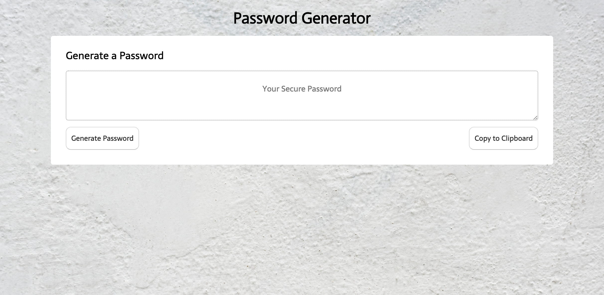

# Password Generator

Deployed site: https://inorrmann.github.io/PW-Generator/

## Description

This application allows users to click on a button to automatically generate a password based on the user's preference, with the following options:

* Length between 8 and 128 characters
* Possibility of using alphanumeric (lower case and upper case) and special characters.

Once password is generated, it appears on the screen, with the option for the user to click on a button to copy password to the clipboard and paste elsewhere.

## Technologies used

HTML - CSS - Javascript